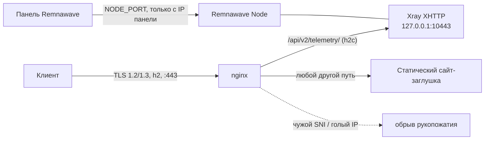

# goji-node-setup

Установщик одной командой для VPS-ноды на [Remnawave](https://docs.rw): TLS-фронт на nginx для **XHTTP-профиля Xray**, сайт-заглушка и переустановка **Remnawave Node** в Docker.

> One command to turn a fresh Debian/Ubuntu VPS into a Remnawave node behind nginx + Let's Encrypt, with an XHTTP Xray profile and a static site on every other path.

---

## Быстрый старт

На VPS, от root (нужны Debian или Ubuntu):

```bash
bash <(curl -fsSL https://raw.githubusercontent.com/goji-app/goji-node-setup/main/xhttp-tls/install.sh)
```

Скрипт сам спросит всё нужное:

| Вопрос | Что ввести |
|---|---|
| Домен сервера | домен, A-запись которого уже указывает на этот VPS |
| `SECRET_KEY` ноды | ключ из Remnawave: Nodes → ваша нода (при переустановке Enter оставит текущий) |
| `NODE_PORT` | порт API ноды для панели, по умолчанию `2222` |
| IP панели | с него будет разрешён доступ к `NODE_PORT` (Enter — не создавать правило файрвола) |
| E-mail | для Let's Encrypt (можно пропустить) |

Все ответы можно передать флагами, тогда вопросов не будет:

```bash
bash install.sh node.example.com --secret-key '...' --node-port 2222 --panel-ip 203.0.113.10 --email me@example.com
```

Перед запуском: нода добавлена в панели, домен указывает на сервер, порты 80 и 443 свободны для nginx.

---

## Как это работает



- **nginx** держит порт 443 и сертификат Let's Encrypt, а Xray слушает только `127.0.0.1`.
- Путь XHTTP (`/api/v2/telemetry/`) проксируется в Xray, все остальные пути отдают статический сайт. Путь можно поменять флагом `--path`.
- Запрос с неизвестным именем сервера или по голому IP получает обрыв TLS-рукопожатия.
- **Remnawave Node** запускается в Docker с `network_mode: host`, чтобы Xray и nginx видели друг друга на `127.0.0.1`.

---

## Что делает скрипт

| Шаг | Действие |
|---|---|
| 1. Вопросы | домен, `SECRET_KEY`, порт API, IP панели, e-mail. Работает и через `curl … \| bash`: ввод читается с терминала |
| 2. Пакеты | `nginx`, `certbot`, `curl` и зависимости из репозиториев дистрибутива |
| 3. Проверка DNS | предупреждает, если домен указывает не на этот сервер, иначе сертификат не выпустится |
| 4. Заглушка | разворачивает один из шаблонов сайта в `/var/www/decoy` |
| 5. nginx :80 | отвечает на проверку Let's Encrypt, всё остальное перенаправляет на HTTPS; при активном `ufw` открывает 80/443 |
| 6. Сертификат | выпуск через `webroot` и автопродление с перезагрузкой nginx, после чего выполняется проверка `certbot renew --dry-run`. Если папка сертификата осталась без конфигурации продления, её старые файлы переносятся в `/root/letsencrypt-backup-…` |
| 7. Remnawave Node | ставит Docker при необходимости, сохраняет старый `docker-compose.yml` в `.bak-<дата>`, пишет новый, скачивает образ `remnawave/node:latest`, **закрепляет его по digest** (`image: remnawave/node@sha256:…`) и запускает |
| 8. Ожидание профиля | **ждёт**, пока в панели профиль ноды переключат на XHTTP (Xray слушает `127.0.0.1:10443`, порт 443 свободен). До этого nginx на 443 не включается, а старый профиль продолжает работать |
| 9. nginx :443 | включает TLS-фронт |
| 10. Самопроверка | заглушка отвечает кодом 200, Xray слушает внутренний порт |

Скрипт можно запускать повторно: уже выпущенный и автопродляемый сертификат он не трогает, установленная заглушка остаётся прежней.

### Флаги

| Флаг | По умолчанию | Назначение |
|---|---|---|
| `<домен>` | спросит | домен ноды (первый аргумент) |
| `--email` | — | e-mail для Let's Encrypt |
| `--secret-key` | спросит | `SECRET_KEY` ноды |
| `--node-port` | `2222` | порт API ноды для панели |
| `--panel-ip` | — | IP панели; для `NODE_PORT` в `ufw` создаётся правило только для него |
| `--xray-port` | `10443` | внутренний порт Xray на `127.0.0.1` |
| `--path` | `/api/v2/telemetry/` | путь XHTTP, начинается и заканчивается на `/` |
| `--template` | `random` | заглушка: `random`, `analytics`, `blog`, `docs`, `saas` |
| `--wait` | `900` | сколько секунд ждать переключения профиля в панели |
| `--skip-node` | — | не трогать Remnawave Node, настроить только nginx и сертификат |
| `--skip-hardening` | — | не применять тюнинг и защиту (BBR/fq, tc, ZRAM, UFW, Fail2ban, ICMP) |
| `--icmp-drop` | — | полностью блокировать входящий ping (по умолчанию лимит 5/сек) |
| `--traffic-control` / `--no-traffic-control` | спросить | блокировка сетей сканеров по публичным спискам (nftables), по желанию |
| `--admin-ip` | IP SSH-сессии | IP администратора, исключённый из блокировок Traffic Control, флаг можно повторять |
| `--check` | — | отчёт «компонент — статус» (то же: `goji-node-check`) |
| `--resume` | — | повторить установку с сохранёнными параметрами |
| `--version` | — | версия установщика |
| `--ssh-port` | определяется | порт SSH для UFW и Fail2ban |
| `--allow-port` | — | дополнительный порт для UFW (`8443`, `8443/udp`), флаг можно повторять |

---

## Профиль Xray для Remnawave

[`xhttp-tls/xray-node-profile.json`](xhttp-tls/xray-node-profile.json) — универсальный профиль, его достаточно один раз создать в панели и назначить нодам:

- inbound `XHTTP-TLS`: `127.0.0.1:10443`, VLESS, транспорт `xhttp`, `security: none` (TLS заканчивается на nginx);
- блокируются: QUIC (UDP 443), исходящий SMTP на порт 25, BitTorrent, частные адреса и домены, реклама и трекеры;
- опциональный outbound-прокси на `172.17.0.1:1080` для части доменов с автоматическим переключением на `DIRECT`, если прокси не отвечает;
- журнал доступа выключен.

Если в профиле у вас нет прокси на `172.17.0.1:1080`, трафик для этих доменов просто пойдёт напрямую.

### Хост в Remnawave

| Поле | Значение |
|---|---|
| Адрес / порт | `<домен>` / `443` |
| Network | `xhttp` |
| Path | `/api/v2/telemetry/` (**без пробела в конце**) |
| Mode | `auto` |
| Security | `tls` |
| SNI | `<домен>` |
| ALPN | `h2` |
| Fingerprint | `firefox` или `chrome` |
| Flow | пусто (Vision с XHTTP не используется) |

> Путь должен совпадать на сервере и в хосте символ в символ. Лишний пробел в конце поля Path в панели не виден, но клиент после этого получает «недоступен». Лучше набирать путь вручную, а не копировать.

---

## Заглушки

Скрипт разворачивает один из шаблонов из [`xhttp-tls/templates/`](xhttp-tls/templates):

| Имя | Что это | Источник и лицензия |
|---|---|---|
| `analytics` | лендинг вымышленного сервиса аналитики | написан для этого репозитория |
| `blog` | простой блог | [westtle/simple-blog-template](https://github.com/westtle/simple-blog-template), MIT |
| `docs` | одностраничный сайт документации | [JMcrafter26/tiny-docs](https://github.com/JMcrafter26/tiny-docs), MIT |
| `saas` | лендинг SaaS-продукта | [hannah-wright/saas-landing-page-template](https://github.com/hannah-wright/saas-landing-page-template), MIT |

Выбор по умолчанию случайный, при повторном запуске сохраняется выбранный шаблон. Лицензии сторонних шаблонов лежат рядом с ними и отдаются как `LICENSE.txt`.

Свой шаблон: положите папку в `xhttp-tls/templates/<имя>/` и выполните `python xhttp-tls/build.py`. Он заново встроит шаблоны в `install.sh`, чтобы скрипт оставался одним самодостаточным файлом.

---

## Состав репозитория

```
xhttp-tls/
├── install.sh            готовый установщик (шаблоны встроены, один файл)
├── install.template.sh   исходник установщика
├── build.py              встраивает templates/ в install.template.sh -> install.sh
├── templates/            сайты-заглушки
├── nginx-template.conf   эталон конфига nginx, который собирает скрипт
├── xray-node-profile.json  универсальный профиль Xray для Remnawave
└── INSTALL.md            краткая памятка
```

---

## Требования

- сервер с Debian или Ubuntu (используется `apt`), root-доступ;
- домен с A-записью на сервер, порты 80 и 443 свободны;
- установленная панель Remnawave и добавленная в ней нода (нужен `SECRET_KEY`);
- на ноде ничего не должно слушать 80 и 443, кроме Xray под старым профилем.

---

## Если что-то пошло не так

| Симптом | Причина и решение |
|---|---|
| `live directory exists for …` от certbot | старая папка сертификата без конфигурации продления: скрипт переносит её в `/root/letsencrypt-backup-…` и выпускает сертификат заново, запустите его ещё раз |
| Xray падает с `address already in use` на 443 | nginx занял 443, пока работает старый профиль: скрипт включает nginx на 443 только после появления Xray на `127.0.0.1:10443`. Если это уже случилось, уберите `/etc/nginx/conf.d/xhttp-tls.conf` и выполните `systemctl reload nginx` |
| Клиент пишет «недоступен» | проверьте путь в хосте (пробел в конце), `ALPN h2`, пустой Flow |
| Сертификат не выпускается | домен указывает не на этот сервер, либо порт 80 закрыт файрволом |

---

## Что стоит знать

- Скрипт **переустанавливает контейнер Remnawave Node** на этой машине: нода будет недоступна около минуты. Старый compose-файл сохраняется как `/opt/remnanode/docker-compose.yml.bak-<дата>`, но подключённые папки и соседние сервисы из него в новый не переносятся, сверьте их.
- `SECRET_KEY` записывается в `/opt/remnanode/docker-compose.yml` с правами только для root.
- Установщик настраивает только описанное выше. Остальная конфигурация сервера (SSH, файрвол, сеть) остаётся на вас.
- Это установщик инфраструктуры. Его не запускали на всех поддерживаемых версиях ОС; прежде чем раскатывать на все ноды, проверьте на одной.
- Репозиторий не содержит ключей, UUID пользователей и адресов реальных нод. Не добавляйте их в публичный репозиторий.

---

## Лицензия

[MIT](LICENSE), © 2026 goji-app. Сторонние шаблоны в `xhttp-tls/templates/` распространяются под своими лицензиями (тоже MIT), их тексты лежат в папках шаблонов.

## Благодарности

Структура проверок, откат SSH-настроек, ранний nftables-слой против ping и идея Traffic Control вдохновлены проектом [ЧебурNET Vision Installer](https://github.com/leonidkopysov/CheburNET-Vision-Installer) (MIT, © 2026 Леонид Копысов). Код здесь написан заново под протокол XHTTP+TLS; протокол, nginx-фронт и профиль Xray не менялись. Списки сетей — [shadow-netlab/traffic-guard-lists](https://github.com/shadow-netlab/traffic-guard-lists), у них своя лицензия.
